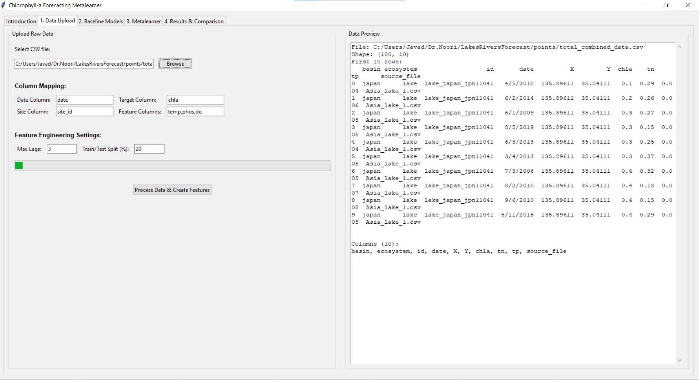
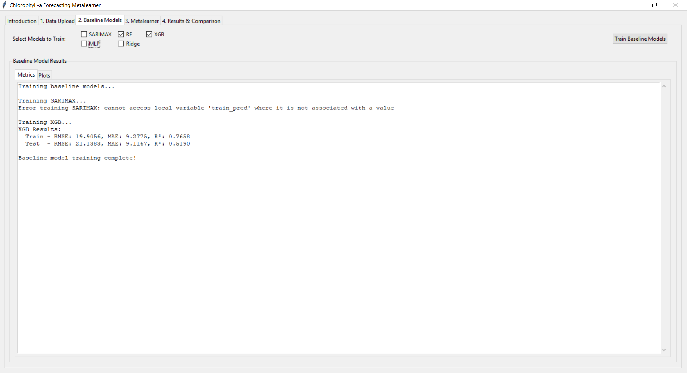
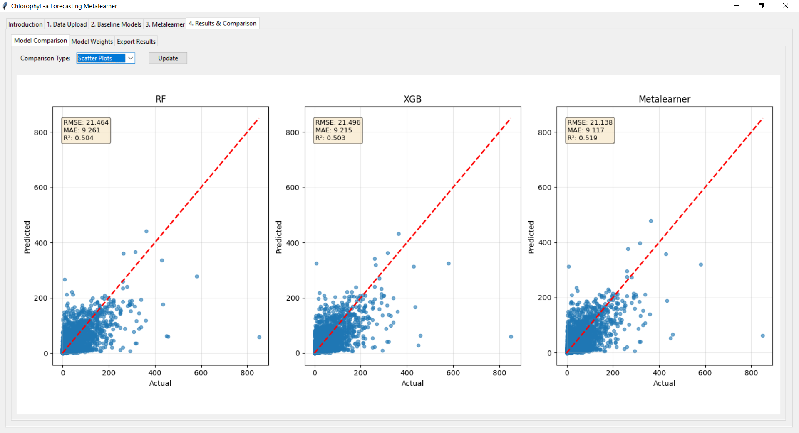

# StackingMetalearner
An application for operational chlorophyll-a forecasting.

## Prerequisites
Python 3.8 or higher
pip package manager

## Install Dependencies
```bash
pip install pandas numpy scikit-learn matplotlib tkinter xgboost statsmodels
```

## Application Workflow

### Step 1: Data Upload
Upload your raw CSV data and configure the preprocessing settings.
Data Upload Tab
<p align="center">
  
</p>
Configure data columns and feature engineering settings

### Step 2: Baseline Models
Train and evaluate multiple baseline forecasting models.
Baseline Models Tab
<p align="center">
  
</p>
Select models to train and view individual performance

### Step 3: Metalearner
Combine baseline model predictions using an intelligent meta-learner.

Metalearner Tab
<p align="center">
  
</p>
Configure and train the metalearner to combine model predictions

### Step 4: Results & Comparison
Compare all models and export results.

Results & Comparison Tab
<p align="center">
  
</p>
Compare model performance and export final results

**Comparison Views:**
- **Scatter Plots**: Side-by-side comparison of all models
- **Metrics Table**: Numerical comparison of performance metrics
